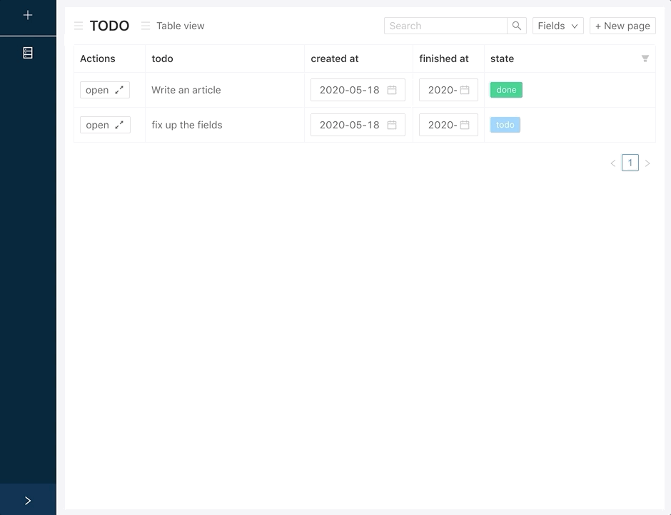
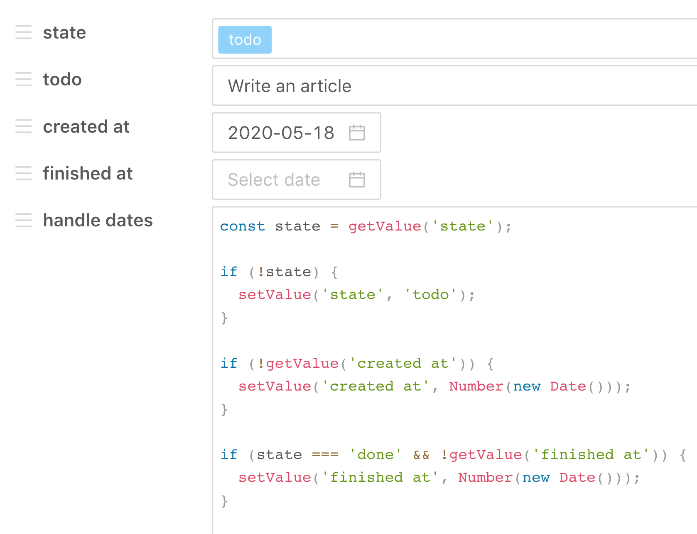
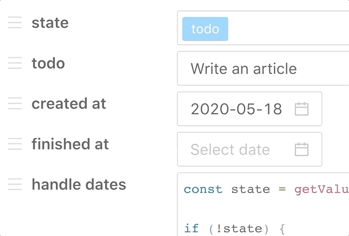
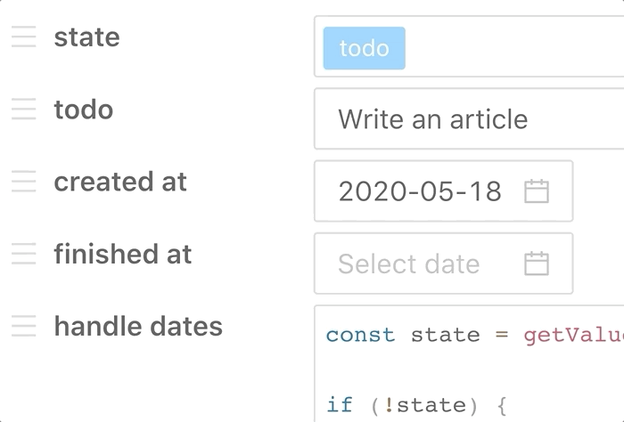
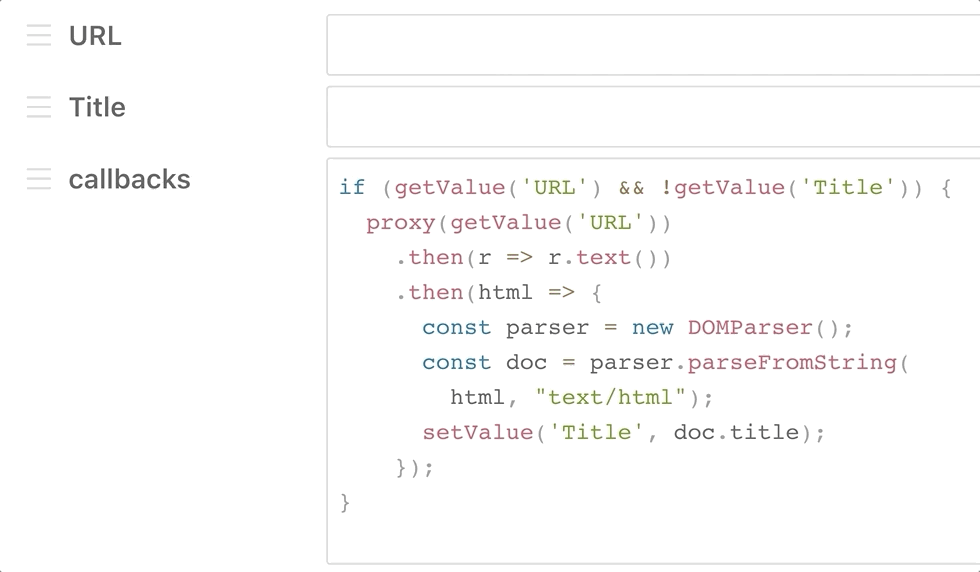

# shelf
Shelf is an experimental table based application. 
It is very flexible and allows users to extend the application with code from inside the app.

### Tech
It is all Typescript + React + Antd components. There is space for a backend, but I haven't implemented it yet.

# A simple todo example
The application allows a user to create a schema composed of fields with a label and an input type. The schema can be used to create entries into a table.

Here you can see a user opening a row of a table. This is just for context before we zoom in and focus on that edit row modal.

Below, is a simple todo schema, on the edit entry screen. It has a title with a text input, a state field with a select input, a "created at" and "finished at" field and a script field called "handle dates". The script is executed after any input data is changed.

This script automates a couple things. It gets the current state value and if it is empty, it will set it to "todo". This is how a user can enter a default value case without the applicaiton actually constricting the user to what the default value can be or how it can be calculated.

Then, the script checks if the created at field is empty. If it is, it sets the created at field to the current time. Then it checks if the state is "done". If the state is done, then the "finished at" field is populated.

### Some more GIF examples
Here we can see that when the "created at" value is cleared, it is automatically set again. That is the script doing that work.

Here we see the "finished at" field being set once the state transitions to "done".

### An example with a network request
The scripts can break out of the application too. This is super, super powerful, but here I will keep the example simple.

